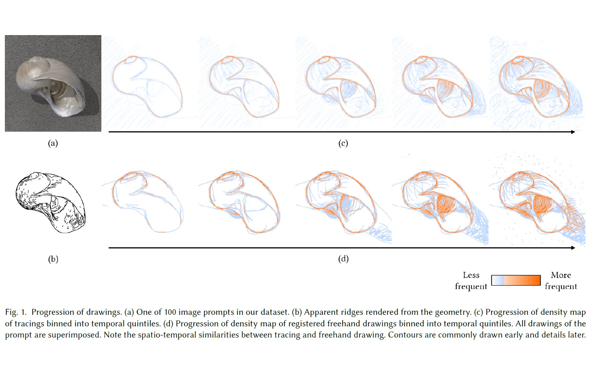

# Tracing Versus Freehand for Evaluating Computer-Generated Drawings (SIGGRAPH 2021)

Zeyu Wang, Sherry Qiu, Nicole Feng, Holly Rushmeier, Leonard McMillan, Julie Dorsey

[[Paper]](https://graphics.cs.yale.edu/sites/default/files/tracing-vs-freehand_0.pdf)
[[Project]](https://zachzeyuwang.github.io/tracing-vs-freehand)
[[Browser]](http://tracer.cs.yale.edu/tracing-vs-freehand/)



## Drawing Dataset

The dataset consists of 1,498 tracings and freehand drawings by 110 participants for 100 image prompts. Our drawings are registered to the prompts and include vector-based timestamped strokes collected via stylus input.

Please run `zsh prepare_data.sh` to download the dataset, which will be placed in the `data` folder (about 600MB after unzipping). All code in this repository takes input from the `data` folder.

`data/tracings.json`, `data/drawings.json`, and `data/drawings_registered.json` use the following format.
```
{
  // each prompt
  "IMAGE_FILENAME.png": {
    // each drawing
    "PARTICIPANT_ID": [
      // each stroke
      {
        "path": string (Unix timestamp, x, y coordinates at each vertex separated by comma)
        "pressure": string (pressure value at each vertex separated by comma)
        "color": string (hex code, e.g., "#000000")
        "width": integer (stroke width on a 800x800 canvas)
        "opacity": float (alpha value from 0 to 1)
      }
      ...
    ]
    ...
  }
  ...
}
```

## Code

Before running any code, please run `conda env create -f environment.yml` and `conda activate tracer`. All code has been tested on Ubuntu 20.04.

`utils/render_png_from_json.py` renders the drawings in png format from the raw JSON data.

`registration/` stores the scripts used to register freehand drawings to the tracing density.

If you need anything in particular, please feel free to reach out to me directly.

## Citation

The dataset and code are released for academic research use only under CC BY-NC-SA 4.0.

If you use the dataset or code for your research, please cite this paper:
```
@article{Wang:2021:Tracing,
  author = {Wang, Zeyu and Qiu, Sherry and Feng, Nicole and Rushmeier,  Holly and McMillan, Leonard and Dorsey, Julie},
  title = {Tracing Versus Freehand for Evaluating Computer-Generated Drawings},
  year = {2021},
  issue_date = {August 2021},
  publisher = {Association for Computing Machinery},
  address = {New York, NY, USA},
  volume = {40},
  number = {4},
  issn = {0730-0301},
  url = {https://doi.org/10.1145/3450626.3459819},
  doi = {10.1145/3450626.3459819},
  journal = {ACM Trans. Graph.},
  month = aug,
  numpages = {12},
  keywords = {sketch dataset, drawing process, stroke analysis}
}
```
